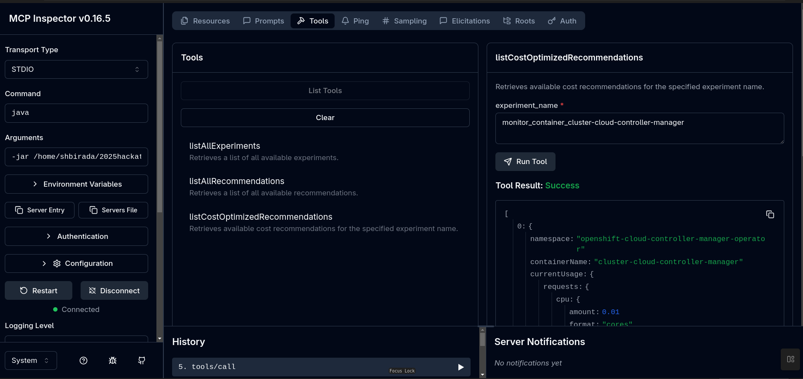

## 🚀 Getting Started

Follow these steps to build the project and prepare it for running.

### 1. Clone the Repository

First, clone this repository to your local machine.
```
git clone git@github.com:kruize/2025hackathon.git
cd kruize_mcp_server
```


### 2. Build the Project
Use the Maven Wrapper (mvnw) to compile the source code and package it into an executable JAR file.
```
./mvnw install
```

This command will run tests and create a .jar file in the target/ directory.

### 3. Deploy kruize using either [local monitoring](https://github.com/kruize/kruize-demos/tree/main/monitoring/local_monitoring) or [bulk](https://github.com/kruize/kruize-demos/tree/main/monitoring/local_monitoring/bulk_demo) kruize-demos scripts

#### 1. Local monitoring demo creates two container experiments and generates recommendations for TFB benchmark workloads
```
./local_monitoring_demo.sh -c openshift -e container
```
 OR

#### 2. Bulk demo creates experiments and generates recommendations for all the containers present in the cluster
```
./bulk_service_demo.sh -c openshift
```

### 4. Set the KRUIZE_URL environment variable

NOTE: If env variable is not set, KRUIZE_URL will default to http://localhost:8080, refer [application.properties](src/main/resources/application.properties)

```
export KRUIZE_URL=http://kruize-openshift-tuning.apps.<cluster_name>.lab.upshift.rdu2.redhat.com
```


### 5. Testing with the MCP Inspector Tool 🔬

##### 1. Install the Inspector Tool

You only need to run this command once to install the tool globally on your machine.

```
npm install -g @modelcontextprotocol/inspector@0.11.0
```
#### Steps for STDIO transport layer:
##### 2. Run the Inspector Tool

Once the build for Kruize MCP server is ready (e.g., with ./mvnw install), open a new terminal window and run the following command to launch the inspector and connect to your server.

```
npx @modelcontextprotocol/inspector
```
The Inspector will now be connected to your server, allowing you to call your tools.

- NOTE: When testing the Kruize MCP server tools with the Bulk demos recommendations API, increase the timeout in the MCP Inspector tool to prevent timeout errors.
- Navigate to Configuration increase `Request Timeout` to `60000(60s)` and `Maximum Total Timeout` to `180000(3mins)`


##### 3. Connect to MCP server using Inspector tool

- Select the `Transport Type` as `STDIO`
- Pass `java` as `Command`
- In the `Arguments` field, provide the full path to the JAR file located in the target directory.
  - for example 
  ```
  -jar /home/username/2025hackathon/kruize_mcp_server/target/kruize_mcp_server-1.0-SNAPSHOT-runner.jar`
  ```

  
#### Steps for Streamable HTTP transport layer:
You'll need two separate terminal windows: one for the server and one for the Inspector tool.
##### 2. Run the MCP Server JAR
  - `Terminal 1`: Run the MCP Server JAR
  - Navigate to your project's directory.
  - Run the executable JAR file. This will start the Quarkus web server.
    ```
    java -jar /home/username/2025hackathon/kruize_mcp_server/target/kruize_mcp_server-1.0-SNAPSHOT-runner.jar
    ```

  You will see log output indicating the server has started and is listening on a port (e.g., Listening on: http://0.0.0.0:8080).
 
##### 3. Connect to MCP server using Inspector tool
  - `Terminal 2`: Run the Inspector Tool
  - Open a new terminal window.
  - Launch the MCP Inspector and point it to your local server's URL.
    ```
    npx @modelcontextprotocol/inspector http://localhost:8080/mcp/
    ```

  The Inspector will connect to your local Java process over HTTP, allowing you to test the streamable transport without needing to deploy.

- `Note`: 
    -   The port number in the URL (8080) must match the quarkus.http.port value in your application.properties file.
    -   When testing the Kruize MCP server tools with the Bulk demos recommendations API, increase the timeout in the MCP Inspector tool to prevent timeout errors.
    -   Navigate to Configuration increase `Request Timeout` to `60000(60s)` and `Maximum Total Timeout` to `180000(3mins)`


##### 4. Using Inspector tool
- Click on `Connect` button
- Once successfully connected try to list the tools
- Current list of tools supported:
  - `listAllRecommendations` - Retrieves a list of all available recommendations.
  - `getCostOptimizedRecommendations` - Retrieves available cost recommendations for all the experiments.
  - `listAllExperiments` - Retrieves a list of all available experiments.
  - `getIdleWorkloads` - Retrieves idle workloads which have specific notification code `323001`. Optionally includes cost recommendations data.



### Kruize MCP Server for OpenShift

This guide provides the steps to containerize and deploy the Kruize MCP server on an OpenShift cluster.

#### 1. Build and Push the Container Image 📦

##### A. Build the Image

Run the docker build command from project's root directory. Remember to replace <registry>/<username>/kruize-mcp-server with your actual image repository.

```
docker build -t <registry>/<username>/kruize-mcp-server:latest .
```
##### B. Push the Image

Push the newly built image to your container registry.
```
docker push <registry>/<username>/kruize-mcp-server:<tag>
```

#### 2. Deploy on OpenShift 🚀

Manifest - manifests/kruize_mcp_server.yaml has the necessary OpenShift resources.

##### Apply the Manifest

Use the oc tool to apply the manifest to your cluster.

```
oc apply -f manifests/kruize_mcp_server.yaml -n openshift-tuning
```

#### 3. Expose the Service

To access the server from outside the cluster, create a Route.

##### A. Create the Route

Expose the mcp-server-service, created in the previous step.

```
oc expose service kruize-mcp-server-service -n openshift-tuning
```

##### B. Get the URL

Find the public URL for the mcp server.

```
oc get route kruize-mcp-server-service -n openshift-tuning --template='{{ .spec.host }}'
```

#### 4. Verification and Testing 🔬

##### A. Check Pod Status

Ensure mcp-server pod is running and ready (1/1).
```
oc get pods -n openshift-tuning
```

##### B. View Logs

Check the application logs using the pod name.

```
oc logs -f <mcp-server-pod-name> -n openshift-tuning
```

##### C. Connect the Inspector Tool

Use the URL from step 3 to connect MCP Inspector tool. The endpoint for the Streamable HTTP transport is /mcp/.

```
npx @modelcontextprotocol/inspector http://<kruize-mcp-server-route-url>/mcp/
```
